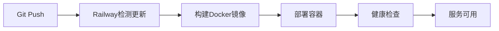

# ZeroTouch Railway部署指南

## 🚀 快速部署到Railway.com

### 准备工作

1. **注册Railway账户**
   - 访问 [Railway.app](https://railway.app)
   - 使用GitHub账户登录

2. **项目要求**
   - Node.js 18+
   - 项目已推送到GitHub仓库

### 🔧 部署步骤

#### 方法一：通过GitHub仓库部署（推荐）

1. **创建新项目**
   ```bash
   # 登录Railway
   railway login
   
   # 连接项目
   railway link
   ```

2. **配置环境变量**
   - 在Railway控制台的Variables选项卡中添加：
   ```
   NODE_ENV=production
   PORT=8080
   ```

3. **自动部署**
   - Railway会自动检测Dockerfile.railway
   - 每次push到main分支时自动重新部署

#### 方法二：使用Railway CLI

1. **安装Railway CLI**
   ```bash
   npm install -g @railway/cli
   ```

2. **部署项目**
   ```bash
   # 初始化项目
   railway login
   railway init
   
   # 部署
   railway up
   ```

### 📁 项目文件说明

- `railway.toml` - Railway配置文件
- `Dockerfile.railway` - 专为Railway优化的Docker配置
- `.env.example` - 环境变量模板
- `package.json` - 包含Railway特定的构建脚本

### 🔄 部署流程



### ⚙️ 配置选项

#### 环境变量设置
在Railway控制台设置以下变量：

| 变量名 | 说明 | 示例值 |
|--------|------|--------|
| `NODE_ENV` | 运行环境 | `production` |
| `PORT` | 服务端口 | `8080` |
| `VITE_API_BASE_URL` | API基础URL | `https://api.example.com` |

#### 自定义域名
1. 在Railway项目设置中点击"Domains"
2. 添加自定义域名
3. 配置DNS记录指向Railway提供的地址

### 🛠️ 故障排除

#### 常见问题

1. **构建失败**
   ```bash
   # 检查构建日志
   railway logs --deployment
   ```

2. **服务无响应**
   - 确保PORT环境变量设置为8080
   - 检查健康检查端点是否可访问

3. **静态资源404**
   - 确保dist目录构建成功
   - 检查nginx配置中的根路径

#### 调试命令
```bash
# 查看服务状态
railway status

# 查看实时日志
railway logs

# 重启服务
railway redeploy
```

### 📊 监控和维护

1. **性能监控**
   - Railway提供基础的CPU、内存监控
   - 可在项目控制台查看资源使用情况

2. **日志管理**
   ```bash
   # 查看最近日志
   railway logs --tail 100
   
   # 实时监控
   railway logs --follow
   ```

3. **备份策略**
   - 代码自动备份在GitHub
   - 建议定期导出配置

### 💰 费用说明

- Railway提供每月$5免费额度
- 超出后按使用量计费
- 可在Account页面查看用量详情

### 🔗 相关链接

- [Railway官方文档](https://docs.railway.app/)
- [Railway定价](https://railway.app/pricing)
- [项目GitHub仓库](https://github.com/your-username/zerotouch2.0)

---

## 📞 技术支持

如遇到部署问题，请：

1. 检查Railway控制台的部署日志
2. 查看本项目的Issues页面
3. 参考Railway官方文档

**部署成功后，您的应用将可通过Railway分配的域名访问！** 🎉
